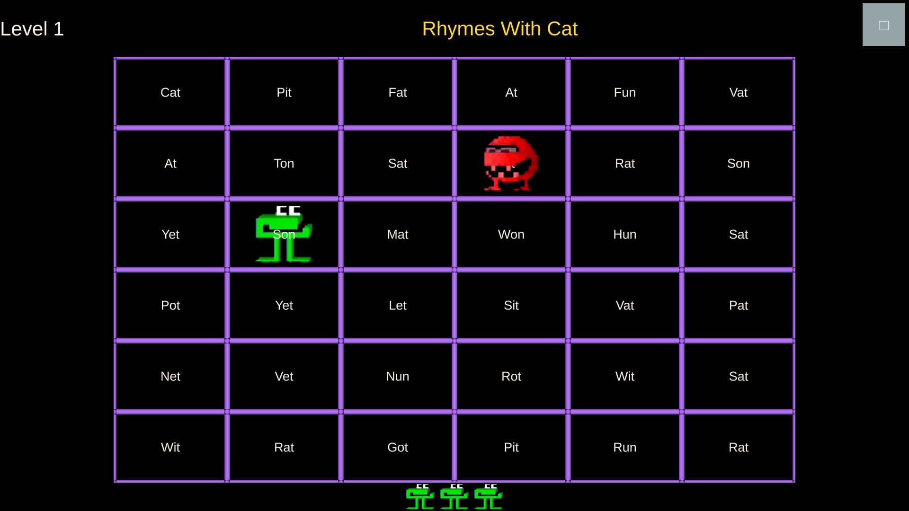

# Word Chompers
## An Educational Game Inspired by the 1980's MECC game "Word Munchers"

### Overview
I have three children in the early stages of reading, and when I explored apps that were supposed to help, I was generally unhappy with the results. As such, I'm building this as a Unity game in order to try out a different approach to a reading app.

Currently, the game is functional, though I have some more bugs to fix. Actively testing with my children. If you clone the repo and install the correct version of Unity, it should run without any special setup.
